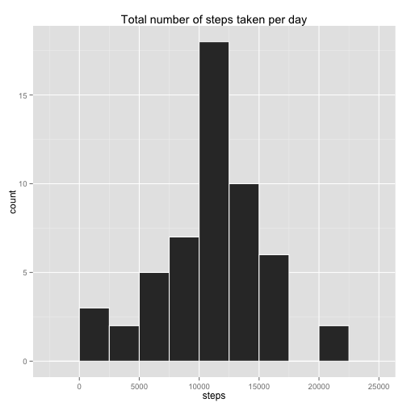
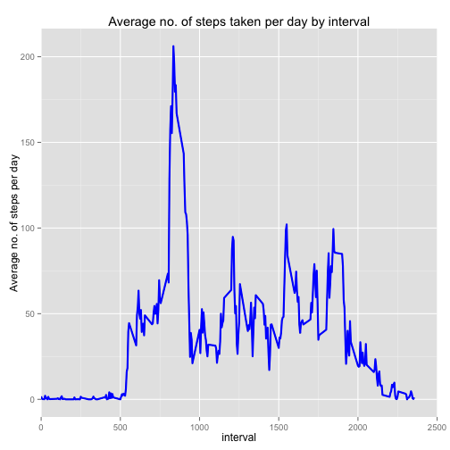
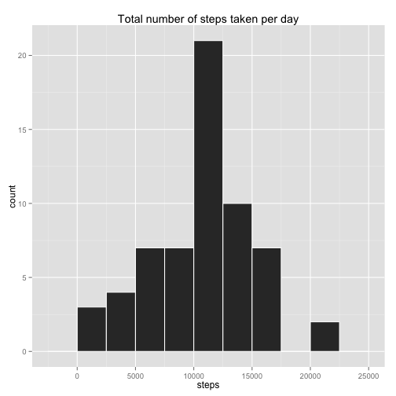
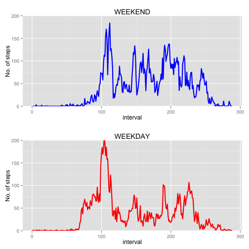

# Reproducible Research
## Assignment 1

### Written by Macarena C. Garcia
### Date: 11 July 2014


## Loading and processing the data

Step 1: Set working directory

```r
setwd("/Users/usaid/Desktop/RepData_PeerAssessment1/mgarcia_assignment1/") 
```

Step 2: Load 'knitr'

```r
library("knitr")
```

Step 3: Load "activity.csv" data file into R

```r
activity <- read.csv("/Users/usaid/Desktop/RepData_PeerAssessment1/activity.csv") 
```

Step 4: Convert file to data table

```r
x <- data.frame(activity)
```

Step 5: Convert date into date format

```r
x$date <- as.Date(x$date)
```


## What is mean total number of steps taken per day?

Step 1: Sum the steps for each day in the data set

```r
subData <- aggregate(steps ~ date, data = x, sum)
head(subData)
```

```
##         date steps
## 1 2012-10-02   126
## 2 2012-10-03 11352
## 3 2012-10-04 12116
## 4 2012-10-05 13294
## 5 2012-10-06 15420
## 6 2012-10-07 11015
```

```r
summary(subData)
```

```
##       date                steps      
##  Min.   :2012-10-02   Min.   :   41  
##  1st Qu.:2012-10-16   1st Qu.: 8841  
##  Median :2012-10-29   Median :10765  
##  Mean   :2012-10-30   Mean   :10766  
##  3rd Qu.:2012-11-16   3rd Qu.:13294  
##  Max.   :2012-11-29   Max.   :21194
```

```r
str(subData)
```

```
## 'data.frame':	53 obs. of  2 variables:
##  $ date : Date, format: "2012-10-02" "2012-10-03" ...
##  $ steps: int  126 11352 12116 13294 15420 11015 12811 9900 10304 17382 ...
```

Step 2: Create histogram

```r
library("ggplot2")
plot1 <- ggplot(subData, aes(x=steps)) + geom_histogram(binwidth = 2500, colour="white")
plot1 + labs(title = "Total number of steps taken per day")
```

 

Step 3: Calculate and report the **mean** and **median** total number of steps taken per day

```r
steps <- subData$steps
mean(steps, na.rm=TRUE)
```

```
## [1] 10766
```

```r
median(steps, na.rm=TRUE)
```

```
## [1] 10765
```

## What is the average daily activity pattern?

Step 1: Subset data table to only include: date, time interval

```r
subData2 <- aggregate(steps ~ interval, data = x, mean)
head(subData2)
```

```
##   interval   steps
## 1        0 1.71698
## 2        5 0.33962
## 3       10 0.13208
## 4       15 0.15094
## 5       20 0.07547
## 6       25 2.09434
```

```r
summary(subData2)
```

```
##     interval        steps       
##  Min.   :   0   Min.   :  0.00  
##  1st Qu.: 589   1st Qu.:  2.49  
##  Median :1178   Median : 34.11  
##  Mean   :1178   Mean   : 37.38  
##  3rd Qu.:1766   3rd Qu.: 52.83  
##  Max.   :2355   Max.   :206.17
```

```r
str(subData2)
```

```
## 'data.frame':	288 obs. of  2 variables:
##  $ interval: int  0 5 10 15 20 25 30 35 40 45 ...
##  $ steps   : num  1.717 0.3396 0.1321 0.1509 0.0755 ...
```

Step 2: Make a time series plot 

```r
plot2 <- ggplot(data=subData2, aes(x=interval, y=steps)) + geom_line() + labs(title = "Average no. of steps taken per day by interval") + labs(x = "interval") + labs(y = "Average no. of steps per day") + geom_line(size=1, col = "blue")
plot2 + coord_cartesian(xlim = c(0, 2500))
```

 

Step 3: Which 5-minute interval, on average across all the days in the dataset, contains the maximum number of steps? 

```r
subset(subData2, steps > 200)
```

```
##     interval steps
## 104      835 206.2
```
**Answer** = 5-minute interval number 08:35

## Imputing missing values

Step 1: Calculate and report the total number of missing values in the dataset

```r
colSums(is.na(x))
```

```
##    steps     date interval 
##     2304        0        0
```

Step 2: Devise a strategy for filling in all of the missing values in the dataset

```r
library(VIM)
```

```
## Loading required package: colorspace
## Loading required package: grid
## VIM is ready to use. 
##  Since version 4.0.0 the GUI is in its own package VIMGUI.
## 
##           Please use the package to use the new (and old) GUI.
## 
## 
## Attaching package: 'VIM'
## 
## The following object is masked from 'package:datasets':
## 
##     sleep
```

```r
set.seed(1328311)
newDF <- hotdeck(x, variable = "steps", ord_var = "date", domain_var = "interval", impNA = TRUE)
```
I chose to implement the popular Sequential, Random (within a domain) hot-deck algorithm for imputation which was the cleanest and simplest way to impute 'donor' values to missing values. 

Step 3: Create a new dataset that is equal to the original dataset but with the missing data filled in

```r
summary(newDF)
```

```
##      steps            date               interval    steps_imp      
##  Min.   :  0.0   Min.   :2012-10-01   Min.   :   0   Mode :logical  
##  1st Qu.:  0.0   1st Qu.:2012-10-16   1st Qu.: 589   FALSE:15264    
##  Median :  0.0   Median :2012-10-31   Median :1178   TRUE :2304     
##  Mean   : 36.4   Mean   :2012-10-31   Mean   :1178   NA's :0        
##  3rd Qu.: 12.0   3rd Qu.:2012-11-15   3rd Qu.:1766                  
##  Max.   :806.0   Max.   :2012-11-30   Max.   :2355
```
The summary above shows all values that have been imputed as TRUE (right hand column) and demonstrates that this new database has ZERO NAs. 

Step 4:Make a histogram of the total number of steps taken each day 

```r
subNEW <- aggregate(steps ~ date, data = newDF, sum)
histNEW <- ggplot(subNEW, aes(x=steps)) + geom_histogram(binwidth = 2500, colour="white")
histNEW + labs(title = "Total number of steps taken per day")
```

 

Step 5: Calculate and report the mean and median total number of steps taken per day.

```r
NEWsteps <- subNEW$steps
mean(NEWsteps)
```

```
## [1] 10477
```

```r
median(NEWsteps)
```

```
## [1] 10600
```

Step 6: Do these values differ from the estimates from the first part of the assignment? What is the impact of imputing missing data on the estimates of the total daily number of steps?

**YES** The values differ and the impact of the imputed missing data basically resulted in a reduction of the mean value for steps taken daily from an original of 10766.19 to 10470.43, and similarly, the median went from an original of 10765 to 10571 with the addition of imputed data. 

## Are there differences in activity patterns between weekdays and weekends?

Step 1: Create a new factor variable in the dataset with two levels -- "weekday" and "weekend" indicating whether a given date is a weekday or weekend day

```r
dateDF <- transform(newDF, weekend=as.POSIXlt(date, format='%Y/%m/%d')$wday %in% c(0, 6))
dateDF$dayOfWeek <- "weekday" 
dateDF$dayOfWeek[dateDF$weekend == "TRUE"]  <- "weekend" 
dateDF$dayOfWeek <- as.factor(dateDF$dayOfWeek)
dateDF$interval <- factor(dateDF$interval)
head(dateDF)
```

```
##   steps       date interval steps_imp weekend dayOfWeek
## 1     0 2012-10-01        0      TRUE   FALSE   weekday
## 2     0 2012-10-01        5      TRUE   FALSE   weekday
## 3     0 2012-10-01       10      TRUE   FALSE   weekday
## 4     0 2012-10-01       15      TRUE   FALSE   weekday
## 5     0 2012-10-01       20      TRUE   FALSE   weekday
## 6     0 2012-10-01       25      TRUE   FALSE   weekday
```

```r
summary(dateDF)
```

```
##      steps            date               interval     steps_imp      
##  Min.   :  0.0   Min.   :2012-10-01   0      :   61   Mode :logical  
##  1st Qu.:  0.0   1st Qu.:2012-10-16   5      :   61   FALSE:15264    
##  Median :  0.0   Median :2012-10-31   10     :   61   TRUE :2304     
##  Mean   : 36.4   Mean   :2012-10-31   15     :   61   NA's :0        
##  3rd Qu.: 12.0   3rd Qu.:2012-11-15   20     :   61                  
##  Max.   :806.0   Max.   :2012-11-30   25     :   61                  
##                                       (Other):17202                  
##   weekend          dayOfWeek    
##  Mode :logical   weekday:12960  
##  FALSE:12960     weekend: 4608  
##  TRUE :4608                     
##  NA's :0                        
##                                 
##                                 
## 
```

```r
str(dateDF)
```

```
## 'data.frame':	17568 obs. of  6 variables:
##  $ steps    : int  0 0 0 0 0 0 0 0 0 0 ...
##  $ date     : Date, format: "2012-10-01" "2012-10-01" ...
##  $ interval : Factor w/ 288 levels "0","5","10","15",..: 1 2 3 4 5 6 7 8 9 10 ...
##  $ steps_imp: logi  TRUE TRUE TRUE TRUE TRUE TRUE ...
##  $ weekend  : logi  FALSE FALSE FALSE FALSE FALSE FALSE ...
##  $ dayOfWeek: Factor w/ 2 levels "weekday","weekend": 1 1 1 1 1 1 1 1 1 1 ...
```

Step 2: Make a panel plot containing a time series plot (i.e. type = "l") of the 5-minute interval (x-axis) and the average number of steps taken, averaged across all weekday days or weekend days (y-axis)

```r
weekEnd <- subset(dateDF, dayOfWeek == "weekend")
weekEndMean <- aggregate(steps ~ interval, data = weekEnd, mean)
weekDay <- subset(dateDF, dayOfWeek == "weekday")
weekDayMean <- aggregate(steps ~ interval, data = weekDay, mean)
```


```r
plotEND <- ggplot(data=weekEndMean, aes(x=as.numeric(interval), y=steps)) + geom_line() + labs(title = "WEEKEND") + labs(x = "interval") + labs(y = "No. of steps") + geom_line(size=1, col = "blue") + coord_cartesian(ylim = c(0, 200))
plotDAY <- ggplot(data=weekDayMean, aes(x=as.numeric(interval), y=steps)) + geom_line() + labs(title = "WEEKDAY") + labs(x = "interval") + labs(y = "No. of steps") + geom_line(size=1, col = "red") + coord_cartesian(ylim = c(0, 200))
library(gridExtra)
grid.arrange(plotEND, plotDAY, nrow = 2)
```

 

## End of document
